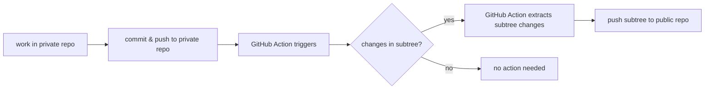

# (public) NixOS configuration

Hi, this is my public NixOS Flake + Home Manager configuration.

My NixOS configuration consists of a public and a private repository. In true idiomatic Nix, I encrypted all my secrets using [agenix](https://github.com/ryantm/agenix). So, then why also create a private repository?

Long story short: there are some configurations which I would preferably not share with the public (SSH config, IP addresses, etc). These configurations, however, do not have to be encrypted (they are not keys or whatever). On top of that, working with agenix for an abundance of configuration will just get messy and ruin the NixOS experience.

To make working with two repos as easy as possible, I set this public repo as a subtree in my private repo. That means I only need to work in the private repo and set up a GitHub Action which automatically pushes relevant changes in the subtree to this public repo:



## Secrets

To manage secrets, I use [agenix](https://github.com/ryantm/agenix) together with [age](https://github.com/FiloSottile/age).

In my private repo I have a secrets.nix file where I map each system and their corresponding public key. This mapping can then be used to determine what secret can be decrypted by which system(s).

To create a secret, first create that secret in the aforementioned `secrets.nix`:

```nix
  "secret1.age".publicKeys = [ user1 system1 ];
  "secret2.age".publicKeys = users ++ systems;
```

Then to create/edit the secret itself:

```bash
agenix -e secret1.age 
```

This will open a temporary file and allows you to insert secret content.

Then, inside any NixOS module, we need to register and use that secret as follows:

```nix
{
  # register
  age.secrets.secret1.file = ./secrets/secret1.age;

  # use
  virtualisation.oci-containers.containers.solidtime = {
    environmentFiles = [ config.age.secrets.secret1.path ];
    # age.secrets.<name>.path is the path where the secret is decrypted to. 
    # Defaults to /run/agenix/<name> (config.age.secretsDir/<name>).
    # We can only pass along a file with decrypted contents
    # ...
  };
}
```
